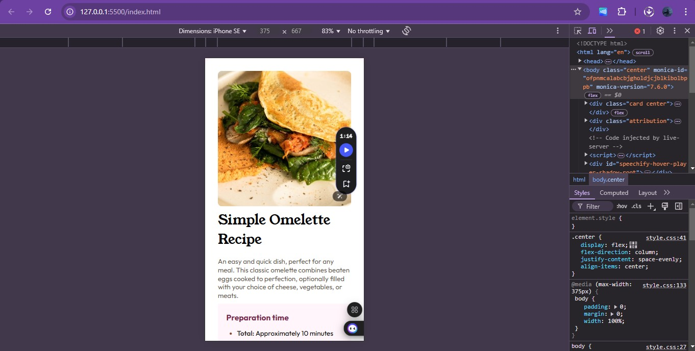
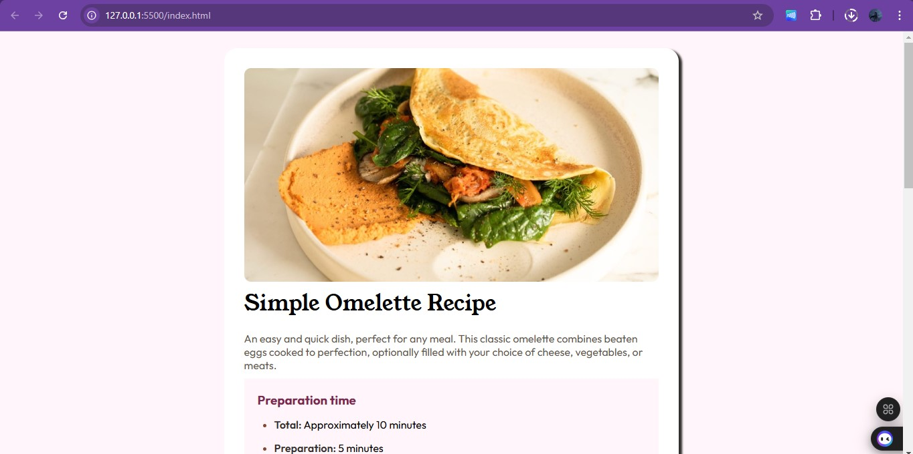

# Frontend Mentor - Recipe page solution

This is a solution to the [Recipe page challenge on Frontend Mentor](https://www.frontendmentor.io/challenges/recipe-page-KiTsR8QQKm). Frontend Mentor challenges help you improve your coding skills by building realistic projects. 

### Screenshot

### Links

- Solution URL: (https://github.com/Othniel-Nduka/socialLinkProfile)
- Live Site URL: (https://recipepagefmchallenge.vercel.app/)

## My process
I would first like to say that this web page gave me a lot of issues. from choosing what font size it should be to the display and how it should be organized. Ultimately, it was successful and I ended up learning a few tricks.

### Built with

- Semantic HTML5 markup
- CSS custom properties
- Flexbox
- CSS Grid
- PC-first workflow

### What I learned

I learnt how to change bullet colors in the unordered list and change the list-style in ordered lists.

## Author
- Frontend Mentor - [@Othniel-Nduka](https://www.frontendmentor.io/profile/Othniel-Nduka)
